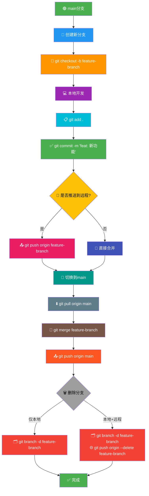

# Git 分支流程图

## Mermaid 代码（复制到在线Mermaid编辑器生成图片）

## 推荐的在线Mermaid编辑器

1. **Mermaid Live Editor** - https://mermaid.live/
2. **Mermaid Chart** - https://mermaidchart.com/
3. **GitHub Markdown** - 直接在GitHub README中显示

## 使用步骤

1. 复制上面的Mermaid代码
2. 粘贴到在线编辑器
3. 导出为PNG/SVG格式
4. 选择超清分辨率（建议1920x1080或更高）

## 图表说明

- 🟢 **绿色**：起始/完成状态
- 🔵 **蓝色**：创建/初始化操作
- 🟠 **橙色**：开发相关操作
- 🟣 **紫色**：文件操作
- 🔴 **红色**：删除操作
- 🟡 **黄色**：决策节点

这个流程图清晰展示了Git分支从创建到删除的完整生命周期，包含所有关键步骤和决策点。

## 更新说明
- 统一使用 `main` 作为主分支名称
- 移除了 `master` 分支相关内容
- 符合现代Git命名规范